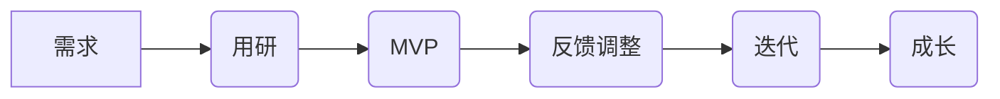

# 精益产品流程

精益产品理念来源于最初丰田生产的精益生产理念，强调接受第一手理念去完成生产。在精益生产中提出了最小可用品方法（MVP），通过引入最小可用品方法，利用用户反馈实时的进行快速迭代和提升。除了最小可用品外，在需求识别阶段需要根据精益产品进行适当的调整。

## 符合精益的产品流程

通用开发流程包含了产品立项、需求分析、开发、体验、测试和发布几个阶段。在产品立项阶段进行产品策划，进行需求和市场分析，提交市场分析报告和产品策划初稿。在需求分析阶段需要搞清楚这个产品具体是什么，包括进行用户研究、需求场景分析、MVP设计、和产品规则、架构、流程、交互的明确过程；在开发阶段完成将产品开发出来的职责；而在体验、测试、发布都阶段都是针对不用范围用户进行意见反馈和修改，从MVP开始，开展内部。  
产品经理的核心职责有两个字，"需求"，搞清楚用户是谁，用户什么情况下有需要的可能，我们 的产品是如何解决用户的需要，已经我们怎么把产品做出来四个核心问题。前三个问题是产品经理的核心职责，最后一个问题需要联合项目经理、项目组合力完成。

## 需求阶段

## 设计阶段

## 最小可用品MVP

在需求分析和产品方向判断过程中，MVP是最有效的试错工具，它是产品中最小可行性功能的集合，MVP的目标是用最低的成本判断产品选择的大方向是对还是错。MVP的实施有两个要点，第一个是大方向判断，即用来判断产品的核心假设是否正确；第二个是低成本，以最小的成本实现MVP。

### 产品的核心假设

什么是产品的核心假设？我们在提出产品的时候通常都有隐含在产品背后的核心假设，例如我们要提供一个类似KEEP的视频健身软件，通常是包含以下核心假设：

> 用户需要视频健身指导。
>
> 用户需要指导的健身频率很高，并且会在家里持续并期待我们提供的服务。

这时的MVP方法则应该是验证用户是否真的需要健身视频指导，我们应该建个群，并在群众给出指导，并观察用户的反馈，以量化用户的需求有多旺盛，进行所谓的抽样调查。事实上，我们做任何决定之前通常都是有假设前提的，而这个假设是在我们脑海中的想象出来的，再未经过事实验证之前都是毫无意义的。为了这个假设直接大规模开发，会出现严重的返工和资源浪费，因此MVP就变的非常关键。

在明白所有的产品都有核心假设之后，如何搞清楚产品的核心假设？通常可以从这几个方向进行思考，需求是否真实存在、用户模型是否真实准确、需求场景和用户模型分析是否到位。一些参考提问如下：

> 产品对用户来说是否具有价值？用户会不会为产品而行动？
>
> 付诸行动用户在测试用户中比例多少？
>
> 与竞品相比，用户认为我们的产品有什么优点？
>
> 不同类型的用户如何认知产品？他们认为解决了自己什么问题？
>
> 不同类型的用户通过什么渠道发现产品或者服务？
>
> 在哪些擦会给你寄给你下使用产品？如何使用？

最后，一个具体的实施方法是，提取最大化需求场景中那一小点共性来做。在前一部分我们已经通过分析进行的用户场景分析，在每一个场景中都会出现的功能实现很可能就是核心假设。

### 低成本的MVP手段

这里列出了微信公众平台、A/B测试、众筹/产品预购、人肉手动式MVP。

微信公众平台包括了公众号、建群和小程序等方式，相比传统开发流程，微信这一类公众平台实际上是成本很低的实现方式。但是公众平台对实现的结果局限性比较强，最终很多时候可能无法验证

A/B测试，在我们无法确定A选择好还是B选择好的时候，可以通过A/B测试的方式让用户帮我们回答哪个好。使用这种方式可以有效的帮我们决策方向，但仍然要注意MVP的两个核心要点，低成本和核心假设。此外，因为已经投入了一定成本，因此A/B的方向已经具备有先验成本，此时可能的选择可能是方案C。

众筹/产品预购，在进行实物制作时，我们可以通过发布产品工程样机、产品视频等方式发起众筹，从而观察市场对产品的预期，以及是否继续进行量产。

人肉手动式MVP，就是所有产品功能都靠人肉实现，客户以为自己的功能时完全靠系统实现，可实际上后台全部都是人工完成。比如有些电商网站初期仅仅靠Excel和临时采购实现电商的功能，但最后无疑是成功的。这种方式可以将关注点放在问题上，而不是如何实现，事实上用户也不会关心如何实现，用户通常只关心自己的问题能否得到有效解决。使用人肉是手动MVP需要付出巨大的努力。

