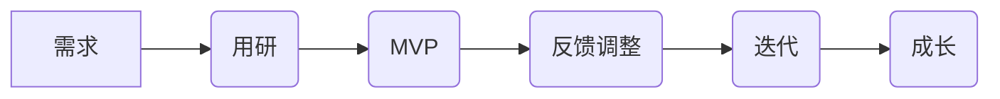

# 精益产品流程

精益产品理念来源于最初丰田生产的精益生产理念，强调接受第一手理念去完成生产。在精益生产中提出了最小可用品方法（MVP），通过引入最小可用品方法，利用用户反馈实时的进行快速迭代和提升。除了最小可用品外，在需求识别阶段需要根据精益产品进行适当的调整。整体流程相比传统设计流程上线周期短，但需要持续进行迭代开发。

## 精益思想的产品研发流程

通用开发流程包含了产品立项、需求分析、开发、体验、测试和发布几个阶段。在产品立项阶段进行产品策划，进行需求和市场分析，提交市场分析报告和产品策划初稿。在需求分析阶段需要搞清楚这个产品具体是什么，包括进行用户研究、需求场景分析、MVP设计、和产品规则、架构、流程、交互的明确过程；在开发阶段完成将产品开发出来的职责；而在体验、测试、发布都阶段都是针对不用范围用户进行意见反馈和修改。  
产品经理的核心职责是围绕"需求"展开的，主要工作可以总结为5W1H，

> Who：产品为谁设计？目标用户是谁？谁购买，谁使用？数量有多少？  
> Why：用户为什么要选择我们的产品？除了我们的产品外，他还有哪些选择？产品被替代的可能性大吗？  
> When：用户什么时候使用我们的产品，多久用一次，会持续多久？  
> Where：用户在哪里使用我们的产品？  
> What：产品具体形式是什么？做成什么样？  
> How：用户是怎么使用它的？

在具体工作工作，需求两个部分，立项之前的需求分析阶段和立项之后的产品设计阶段。在需求阶段，产品经理要确定谁什么时候为什么用我们的什么产品，其中who代表了广度，谁来用；why代表强度，用户为什么用我们的产品；when，用户什么时间、多久使用一次的问题，产出物包括产品市场调查分析报告、产品策划方案等内容。在设计阶段，是立项通过后，通过引入需求场景分析模型，重点落实where、what和how 的问题，将最开始的产品点子细化为用户使用场景。

在MVP阶段，通过分析所有场景中的共性特点，选取其中最核心的假设进行最小成本验证，产出物为MVP原型设计。

在反馈调整阶段，随着测试广度的开展和验收测试，进行持续的迭代升级，并根据不同范围的用户进行意见反馈和修改，包括开发、内部测试、公众测试直至产品上线至产品运营阶段。

## 需求阶段

### 需求是什么

在经济学领域对需求有两个特点，

> 你想要的东西，别人也想要；
>
> 人的需求是在不断的变化，不断地升级；

这两个特点表述了需求是一群人同时需要且不断升级变化的一种需要。整体而言，需求是让人类变得更好的源动力。

在产品领域，需求的定义是指用户对某个产品的可以被量化的需要。这个定义提示了需求的两个特性，一是需要，而是可被衡量。一方面，在人性的深处，多数充斥着各类不满，希望占有更多的资源，满足自己或群体中各个层级的需要（马洛斯需求理论）；另一方面，产品经理在当下不可能像上帝一样满足所有人的所有需求，因此在工作中需要满足自己通过努力可以满足的不满，并且量化自己在产品方面的工作，这个量化就取决于用户对产品采取了多少行动。一个例子就是，多数人都会喜欢吃更美味的食物，但是当产品经理做出了米其林三星的食物之后，并不是所有人都为昂贵的价格买单。人内心需要通常是无限的，但为了需要可以买单的内容却是有限的，而后者就是真实需求。

拆解开来，需求分了两个部分，用户需要和用户要的起，满足这两点用户才会为产品买单。

### 如何量化需求

对于外行而言，可能会凭感觉去衡量产品的好坏，而作为产品经理，要尽可能的把自己的事情系统的做好，量化需求就是最重要的部分。衡量产品的好坏，我们可以用**产品强度**来量化，

$$
产品强度=产品体验-产品成本
$$

做一个好的产品，意味着在尽量识别、控制成本的前提下，努力提升产品体验，而针对产品体验和产品成本可以进一步拆解，一个好的MRD应该包含以下几个部分。

#### 产品成本

产品的成本包括时间、钱、风险和行动。

时间成本，是可见成本中的一种，降低时间成本就是提升产品效率。无论是“Kill time”向还是“saving time”向产品中，很多品类的成功都是提升了时间效率，比如各类时间管理产品、云存储产品等，甚至很多游戏都是通过提升时间利用效率，来实现产品成功，比如王者荣耀就将MOBA类游戏单局时间从1小时压缩至15分钟左右，从而取得了巨大的成功。在对公产品应用中，关注时间成本是非常重要的。如果产品体验差不多的情况下，给用户节省时间可以有效提高产品强度。

货币成本，是最明显的成本因素。客单价、单位坪效、团队人均产出比等都是衡量产品的货币成本的手段。很多产品的成功是通过提升规模效应摊薄产品平均利润压力，取得竞争优势；也可以通过技术升级等方式，降低制造成本，从而可以客单价等货币成本来增强产品强度。

风险成本，是隐性成本的一种。当用户发现某个产品具有潜在风险的时候，即使产品价格很便宜也可能会放弃这个产品。比如对于门锁的购买，价格高的产品往往更受人欢迎，因为多数用户在没有判断依据的时候，通常会用产品价格来间接判断产品引入的风险。此外，用户对使用产品带来的"别人的看法"也会非常看重，比如完整的隐私保护、品牌的定位都会潜在影响客户的为产品买单的行为。

行动成本，也是隐性成本，是指用户天生都是懒的，遇到有难度的改变，比如复杂的操作流程时，往往会选择放弃。也因此，好的产品设计要简洁和易用，最好是婴儿都明白如何操作。我们在设计一款产品时，一个重要的考察点就是对竞品而言，这个产品的改造难度有多大。

团队成本，产品团队在进行产品方向决策时都包含着隐形成本，在进行每一个方案、或者考察点进行决定后，就意味着损失了另外一个方向或决策的收益，而这一部分就是团队成本，经济学中称这个为沉默成本。而后续的MVP进行尽量减少这个成本的一个实际操作方法，但在方案之处，我们仍然需要考虑这一部分的成本。

#### 产品体验

产品强度的高度取决于产品体验，而产品体验部分在产品思维里已经进行过分解。整体而言，能给用户惊喜、超出用户预期的产品体验才是体验，在产品体验照顾用户心理和情感。

### 需求的变化

## 策划阶段

在需求阶段，通过对前期的市场预期和用户范围研究，确定了粗颗粒度的产品方向，解决做还是不做的问题。而在用研阶段，则是在继续针对需求进行进一步细化，解决谁在什么场景下为什么使用我们的产品的问题。在这一部分，我们要开展用户研究、并进行己需求场景分析、定义产品规则并进行最初的方案设计。

### 用户研究

用户研究要搞清楚的问题是搞清楚哪些人会是真实的用户，其中最重要的原则是获得真实的足量的用户反馈，采取的手段可以包含访谈和问卷调查。但无论使用哪种方式，人们回答访谈和问卷时都会出现与真实需求的偏差，人们在别人面前总愿意表示自己更好的一面，提问者和回答者都会产生与真实情况发生偏移，而这会影响调查的真实性，而一点起点出错后，后面所有的设计都会是无用的，失去了商业价值。因此用户研究，要利用手段己确保调查的真实性，搞清楚真正的用户是谁。另外，用户研究是贯穿于整个产品的生命周期的，这一方面是用户的实际需求会发生升级或变化，另一方面，我们产品迭代的过程也会发生用户范围的变化，而产品迭代依赖真实用户的反馈。

#### 开展用户研究的要点

1、在不同的阶段选择合适的研究方式。

* 需求挖掘阶段，避免使用问卷方式，而是使用访谈。
* 开发阶段，进行方案纠结时，使用A/B测试
* 产品上线后，可以开展问卷或者定性调查。
* 网络检索或潜伏在产品论坛、
* 使用暗中观察的用户调研方式。

2、遵循一般的用户研究技巧，这里引用如下：

> 问卷设计时获取真实反馈的技巧  
>     **别考验用户的耐心**：问卷设计的问题量尽可能少，一次只问明白一个重点即可，多次发放小问卷胜于一次性让用户答一张大问卷。  
>     **选项的完整和独立**：多个答案选项之间一定要各自独立、完全穷尽，独立意味着没有交叠部分；穷尽意味着提供的选项要覆盖所有可能性，不会出现用户被迫从选项中挑一个的情况，比如“不记得了”也是一种可能。  
>     **避免模糊用语**：清晰准确地描述你的问题和答案，以获得真正定量的统计数据。如果不同人对问题或答案中涉及的词汇定义有不同的理解，那么这个问题或答案就是模糊不清的。例如，答案中出现“经常、偶尔”等词语，就是有问题的。因为对不同人来说“经常、偶尔”的定义是不同的，有人认为每天才是经常，有人可能觉得一个月一两次也是经常。  
>     **问卷数据清洗**：把一些明显紊乱、无效的数据清理排除掉再进行问卷数据统计。
>
> 访谈时获取真实反馈的技巧  
>     **第三方立场**：在访谈的最开始亮出“第三方”立场，表明自己是受产品设计者委托来进行的调研；即使不是第三方也要扮演第三方，打死也别承认这个产品就是你自己设计的。  
> 由浅入深：访谈的话题层次由浅入深，别一上来就问敏感话题，用一些简单易答或活跃气氛的问题作为开场白，再步步深入更正式和敏感的话题。  
>     **聚光灯留给用户**：用用户语言说话，避免专业名词，用户研究不是产品设计者的炫技场。要尽量保持“无我”状态，任何让你和用户产生距离感的表达都要克制。让用户感觉“我的反馈很重要”。  
> 及时确认和追问：当不能辨识用户的意思时，一定要做进一步确认。比如问用户“不好意思，我理解你的意思是说⋯这样对吗？”当发现用户跑题或用一些模糊不清的话语简单带过问题时，要及时追问下去。比如用户说“挺好的”“不太喜欢”，要具体问清好或不好的具体感觉是什么，针对哪一方面而言。  
>     **关注隐蔽信息**：有时候用户说了什么不是最重要的，一些没说出口的东西才是用户研究需要关注的重点。比如用户在谈到某个话题时传递出了异样的情绪，或者用户的思考模式异于你的预期，这些细节背后隐藏的东西都值得思考和挖掘，它们更具价值。  
>     **避免诱导**：尽量避免提出封闭式问题。刚接触用户研究时，最严重也最易犯的错误就是自顾自讲了一堆产品的方案、思路或假设，问用户会不会喜欢或会不会购买。我们要知道，这样的提问完全是没有意义的。不管用户回答“是”或“否”，那都不是他心中真实的答案，或说不是真实情景中他会采取的行动。  
> 保持专注和耐心：不要急着推进你的问题，给用户一些思考和停顿的时间。在收到负面甚至贬损的反馈时，也要耐心、平静地向用户确认问题，不要认为用户的批判是在针对设计者。为了获得认同感流露出任何情绪都是不专业的表现。

#### 用户研究的产出

用户研究的手段是多样，而用户研究的产出是产品的核心因子，并根据产品的核心因子为用户进行分类，并建立用户模型，用户模型可以用两轴四象限法进行分类，

> 比如女装产品的例子:
>
> 核心因子：消费能力+潮流敏感度
>
> 纵轴：消费能力的高低
>
> 横轴：潮流敏感度的强弱
>
> 

### 需求场景分析

在进行了用户分类之后，可以根据已有的用户分类。在做产品之初，需要种重点按照场景分析产品的使用，并通过用户场景分析，为最小可用品进行集中铺垫。解决谁（who）在什么时候（when）以及什么场景（where）下，使用（how）什么方案解决。这一部分的主要输入为用户分类，输出为场景需求分析表，场景需求分析表中表述谁在什么场景下，通过什么操作路径满足需求，并排定场景优先级。

#### 从用户场景入手

进行需求场景分析依赖用户类型，在用户分析部分通过两轴四象限的方法已经对用户进行了初步分类，在这一部分则要从用户角色入手，并根据用户在不同的时间、地点、情景进行差异化分析。例如QQ同步助手的场景分析案例如下

对于工具类应用，产品要解决的问题比较清楚，用户在人口、社会学方面的影响会比较明显，可以按照使用场景来划分用户模型。而对于音乐、社交或者电商类的应用，则举要考虑心理学、人口学等方面的因素。

对于方案分析部分，则要考虑需要必须有完整的操作路径，沿着用户完成任务的闭环路径走一遍，记录所有的行为步骤。确保行为步骤，如场景触发-a行动-b行动-c行动-问题解决这歌过程，并且关注用户起点和终点。此外，对于对于用户的路径可以通过绘制用户体验曲线，强调提升峰值体验和终值体验以带来良好的产品体验。关于用户体验曲线，可以参考产品思维中用户体验部分的分解。

#### 场景需求分析表样例

### 产品规则

### 技术架构

### 交互设计

## 最小可用品MVP

在需求分析和产品方向判断过程中，MVP是最有效的试错工具，它是产品中最小可行性功能的集合，MVP的目标是用最低的成本判断产品选择的大方向是对还是错。MVP的实施有两个要点，第一个是大方向判断，即用来判断产品的核心假设是否正确；第二个是低成本，以最小的成本实现MVP。

### 产品的核心假设

什么是产品的核心假设？我们在提出产品的时候通常都有隐含在产品背后的核心假设，例如我们要提供一个类似KEEP的视频健身软件，通常是包含以下核心假设：

> 用户需要视频健身指导。
>
> 用户需要指导的健身频率很高，并且会在家里持续并期待我们提供的服务。

这时的MVP方法则应该是验证用户是否真的需要健身视频指导，我们应该建个群，并在群众给出指导，并观察用户的反馈，以量化用户的需求有多旺盛，进行所谓的抽样调查。事实上，我们做任何决定之前通常都是有假设前提的，而这个假设是在我们脑海中的想象出来的，再未经过事实验证之前都是毫无意义的。为了这个假设直接大规模开发，会出现严重的返工和资源浪费，因此MVP就变的非常关键。

在明白所有的产品都有核心假设之后，如何搞清楚产品的核心假设？通常可以从这几个方向进行思考，需求是否真实存在、用户模型是否真实准确、需求场景和用户模型分析是否到位。一些参考提问如下：

> 产品对用户来说是否具有价值？用户会不会为产品而行动？
>
> 付诸行动用户在测试用户中比例多少？
>
> 与竞品相比，用户认为我们的产品有什么优点？
>
> 不同类型的用户如何认知产品？他们认为解决了自己什么问题？
>
> 不同类型的用户通过什么渠道发现产品或者服务？
>
> 在哪些擦会给你寄给你下使用产品？如何使用？

最后，一个具体的实施方法是，提取最大化需求场景中那一小点共性来做。在前一部分我们已经通过分析进行的用户场景分析，在每一个场景中都会出现的功能实现很可能就是核心假设。

### 低成本的MVP手段

这里列出了微信公众平台、A/B测试、众筹/产品预购、人肉手动式MVP。

微信公众平台包括了公众号、建群和小程序等方式，相比传统开发流程，微信这一类公众平台实际上是成本很低的实现方式。但是公众平台对实现的结果局限性比较强，最终很多时候可能无法验证

A/B测试，在我们无法确定A选择好还是B选择好的时候，可以通过A/B测试的方式让用户帮我们回答哪个好。使用这种方式可以有效的帮我们决策方向，但仍然要注意MVP的两个核心要点，低成本和核心假设。此外，因为已经投入了一定成本，因此A/B的方向已经具备有先验成本，此时可能的选择可能是方案C。

众筹/产品预购，在进行实物制作时，我们可以通过发布产品工程样机、产品视频等方式发起众筹，从而观察市场对产品的预期，以及是否继续进行量产。

人肉手动式MVP，就是所有产品功能都靠人肉实现，客户以为自己的功能时完全靠系统实现，可实际上后台全部都是人工完成。比如有些电商网站初期仅仅靠Excel和临时采购实现电商的功能，但最后无疑是成功的。这种方式可以将关注点放在问题上，而不是如何实现，事实上用户也不会关心如何实现，用户通常只关心自己的问题能否得到有效解决。使用人肉是手动MVP需要付出巨大的努力。

