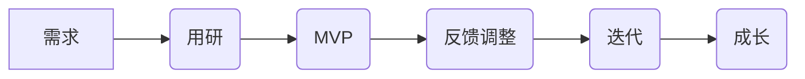

# 精益产品设计流程

```mermaid
graph LR
A[需求] -->B(用研)
    B --> C(MVP)
    C -->D(反馈调整)
    D -->E(迭代)
    E -->f(成长)
```
精益产品理念来源于最初丰田生产的精益生产理念，强调接受第一手理念去完成生产。在精益生产中提出了最小可用品方法（MVP），通过引入最小可用品方法，利用用户反馈实时的进行快速迭代和提升。除了最小可用品外，在需求识别阶段需要根据精益产品进行适当的调整。
## 精益

